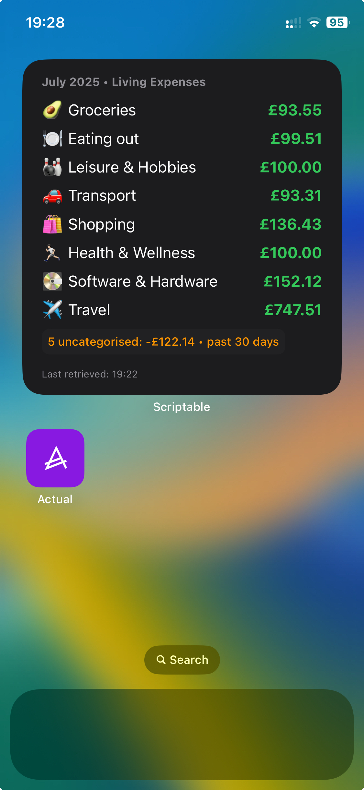
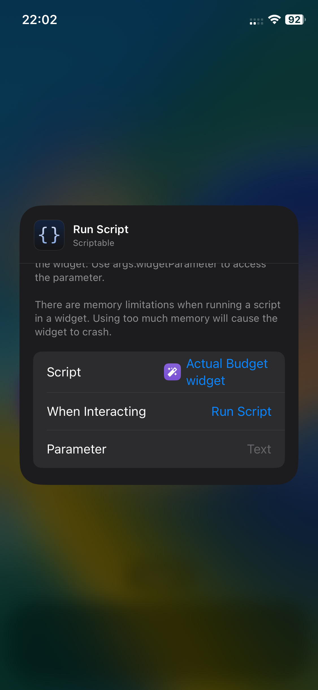

# 📊 Actual Budget Widget for iOS (Scriptable)

This is a custom iOS widget for [Actual Budget](https://actualbudget.org), built using [Scriptable](https://scriptable.app). It displays the balances for a specific category group (like "Living Expenses") from your synced Actual data.

## 📷 Widget Preview





## 🧰 Features

- 🧠 Caches the latest data locally for offline access
- 🔁 Auto-refreshes every 6 hours (or every 30 mins if offline)
- 🎨 Fully customizable fonts, colors, and layout
- 🕓 Displays "last updated" timestamp with error fallback
- 📅 Shows balances for the current month

## 📦 Requirements

- iOS device with the **Scriptable** app installed
- A running instance of [actual-http-api](https://github.com/jhonderson/actual-http-api) (via Docker or Node.js)
- Your Actual Budget server must be accessible via HTTPS for widgets to work

## 🚀 Setup

1. **Install Scriptable** from the App Store on your iPhone.

2. **Open Scriptable → create a new script**, and paste in the contents of [`actual-budget-widget.js`](./actual-budget-widget.js).

3. At the top of the script, edit the following config values:

```js
const syncId = "YOUR_SYNC_ID"
const apiKey = "YOUR_API_KEY"
const apiBaseUrl = "https://your-actual-api.example.com"
const targetGroupName = "Category Group Title"
```

4.	**Optional: Customize appearance** (fonts, colors, spacing).

5.	**Run the script once** in the Scriptable app to confirm it works. It should show a list of categories and their balances.
	
6.	**Add a Scriptable widget to your home screen:**
	•	Long press on the home screen → tap “+” → search for “Scriptable”
	•	Add a Medium or Large widget
	•	Tap the widget → choose your script

## 💾 Offline Support
- The script automatically stores the most recent successful API response in Scriptable’s secure keychain.
- If the API can’t be reached, the widget falls back to this cached data.
- Failed loads shorten the refresh interval to 30 minutes.

## 🛠 Customization

You can adjust:
- Font sizes and spacing
- Colors for titles, balances, positive/negative values
- Category group name
- Refresh intervals (manually, if desired)

## 🧑‍💻 Credits

Uses:
- Scriptable by Simon B. Støvring
- Actual Budget
- actual-http-api by jhonderson


## 📜 License

MIT — open source and free to adapt.
